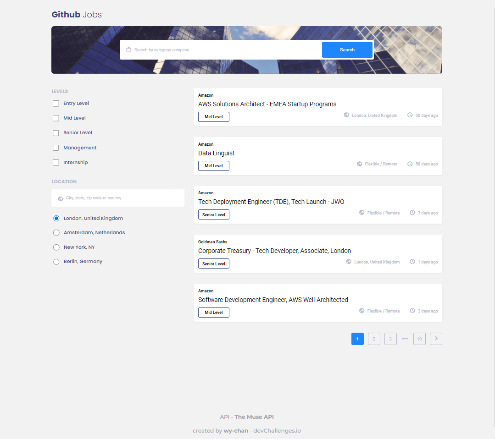
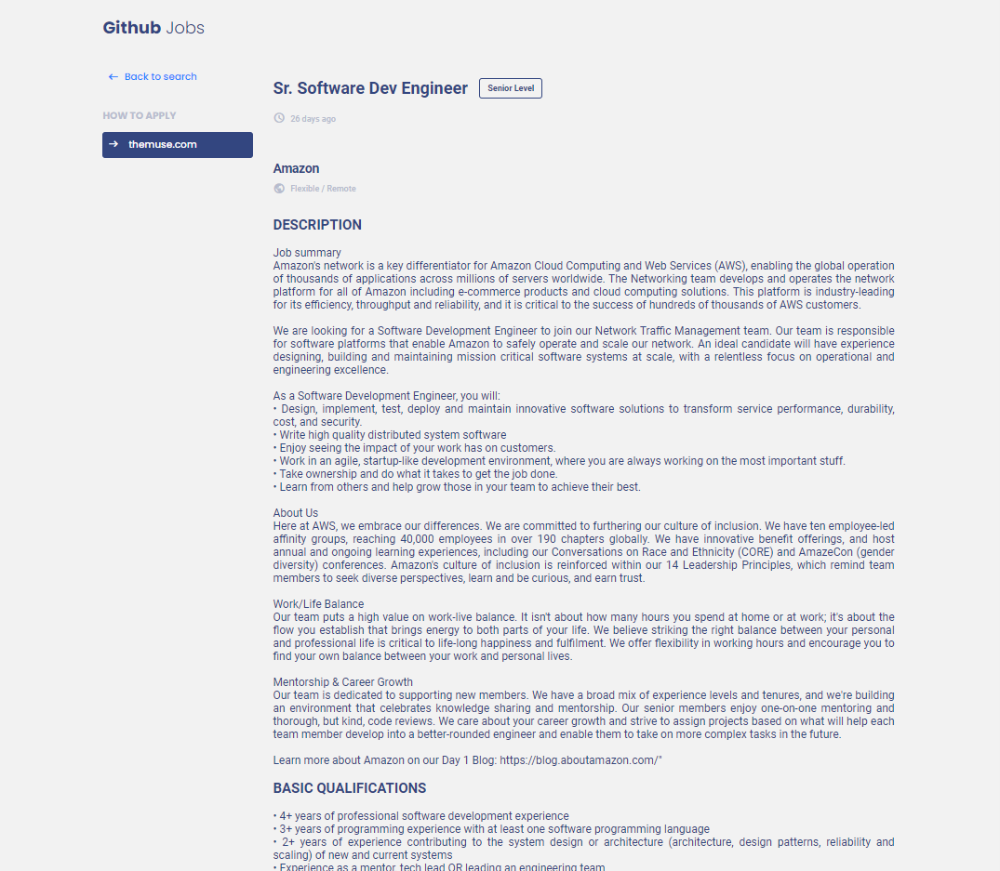
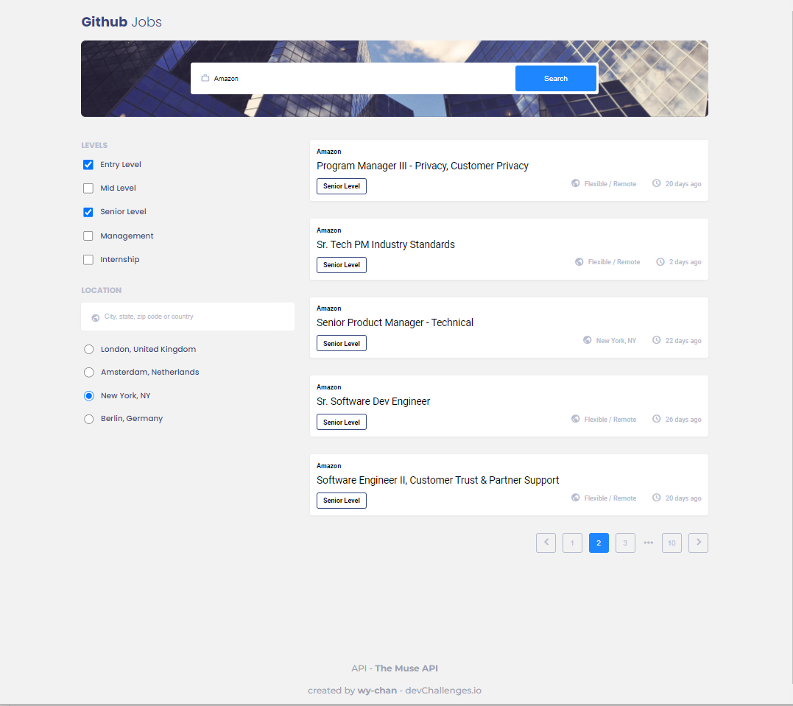
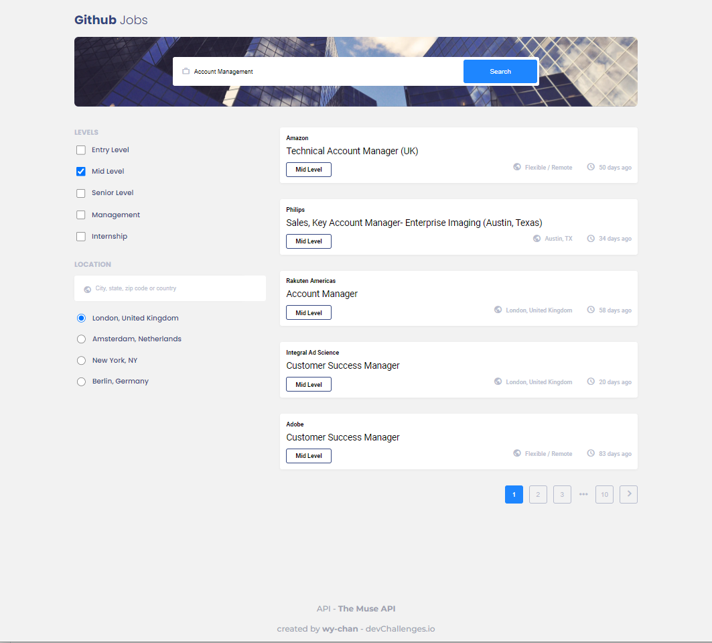
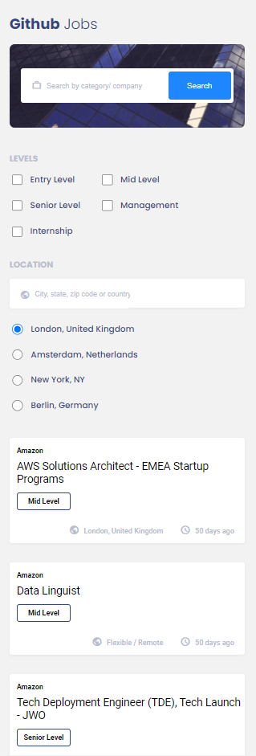
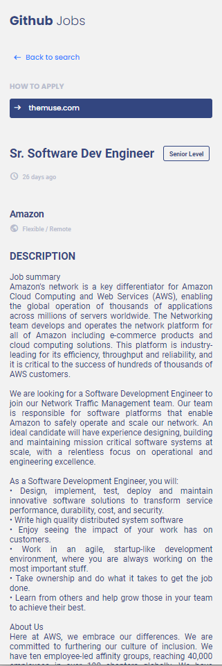
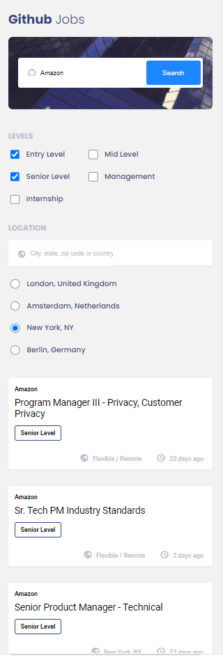
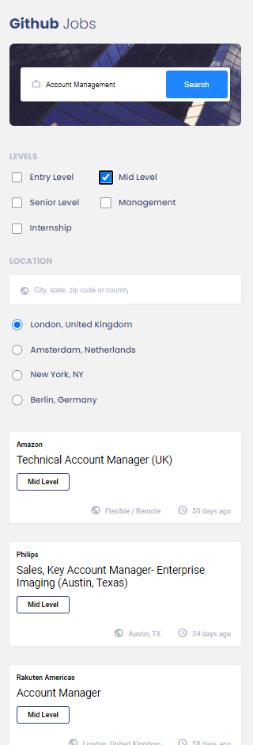

<!-- Please update value in the {}  -->

<h1 align="center" id="button">Github Jobs</h1>

   Solution for a challenge from  <a href="http://devchallenges.io" target="_blank">Devchallenges.io</a>.

  <h3>
    <a href="https://wy-chan.github.io/devchallenges_GithubJobs">
      Demo
    </a>
     | 
    <a href="https://github.com/wy-chan/devchallenges_GithubJobs">
      Solution
    </a>
     | 
    <a href="https://devchallenges.io/challenges/TtUjDt19eIHxNQ4n5jps">
      Challenge
    </a>
  </h3>

<!-- TABLE OF CONTENTS -->

## Table of Contents

- [Overview](#overview)
  - [Built With](#built-with)
- [Features](#features)
- [How to use](#how-to-use)
- [Contact](#contact)
- [Acknowledgements](#acknowledgements)

<!-- OVERVIEW -->

## Overview

   

   &nbsp;&nbsp;
   

   

   &nbsp;&nbsp;
   

   

   &nbsp;&nbsp;
   &nbsp;&nbsp;
   &nbsp;&nbsp;
   
   

   

See demo here: https://wy-chan.github.io/devchallenges_GithubJobs/

Challenge: Create a job search using an API.

### Built With

- HTML
- CSS
- JavaScript
- [React](reactjs.org)

## Features

<!-- List the features of your application or follow the template. Don't share the figma file here :) -->

This application/site was created as a submission to a [DevChallenges](https://devchallenges.io/challenges) challenge. The [challenge](https://devchallenges.io/challenges/TtUjDt19eIHxNQ4n5jps) was to build an application to complete the following user stories:

<i color="gray">Due to depreciation of GitHub Jobs site, I used another API for this page. Some features listed below are not available in this API.</i>

- [x] User story: I can see a list of jobs in a city by default
- [x] User story: I can search for jobs with a given keyword
- [x] User story: I can search for jobs with a city name, zip code, or other location
- [x] User story: I can select one option from at least 4 pre-defined options
- [x] User story: I can search for a full-time job only <i color="gray">(I changed this to "levels" options due to features of the API.)</i>
- [x] User story: I can see a list of jobs with their logo, company name, location, and posted time. <i color="gray">(Company logo is not provided in this API.)</i>
- [x] User story: When I select a job, I can see job descriptions and how to apply like the given design.
- [x] User story: When I am on the job details page, I can go back to the search page
- [ ] User story (optional): I can see a list of jobs in the closest city from my location by default
- [x] User story (optional): I can see jobs on different pages, 5 items on each page

## Acknowledgements

<!-- This section should list any articles or add-ons/plugins that helps you to complete the project. This is optional but it will help you in the future. For example -->

#### Basics:
- [Steps to replicate a design with only HTML and CSS](https://devchallenges-blogs.web.app/how-to-replicate-design/)
- [Marked - a markdown parser](https://github.com/chjj/marked)

#### Fonts & Icons:
- [Google Fonts](https://fonts.google.com/)
- [Material Icons](https://google.github.io/material-design-icons/)

#### API:
<i>(The GitHub Jobs API -https://jobs.github.com/api is no longer available)</i>
- [THE MUSE](https://www.themuse.com/developers/api/v2)

## Contact

- GitHub [@wy-chan](https://github.com/wy-chan)
- CodePen [@wy-chan](https://codepen.io/wy-chan)
